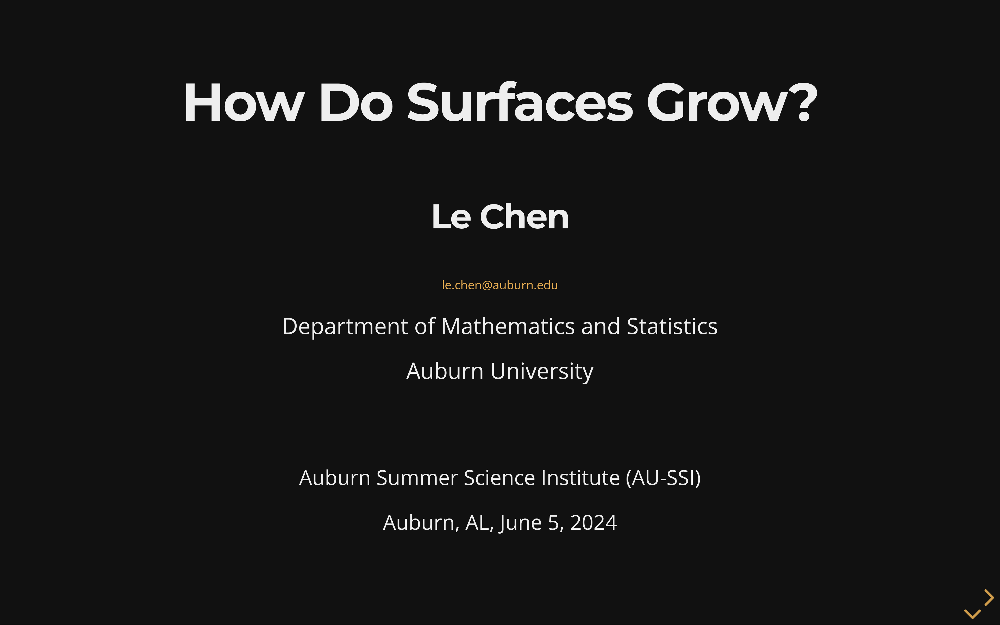
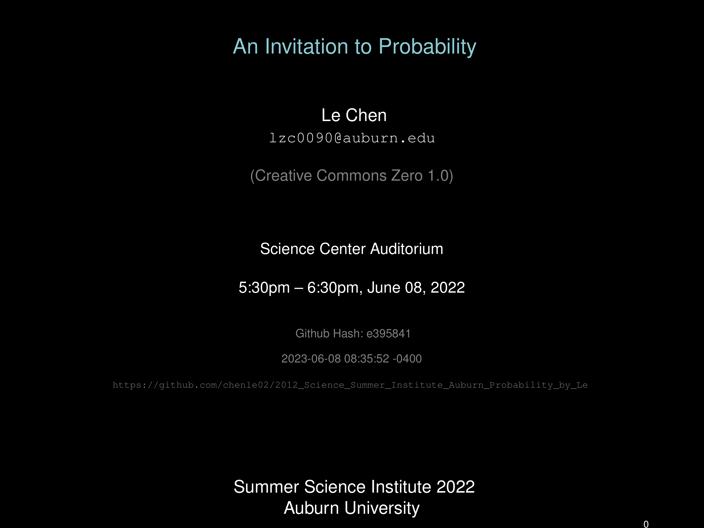

 [](https://doi.org/10.5281/zenodo.10206799)
 
 
 

 # Summer Science Institute at Auburn — Probability Module

 A collection of slides, code examples, and resources for the “Probability” topic presented by Le Chen at Auburn University's Summer Science Institute (SSI), 2022–2024.

 ## Table of Contents

 1. [What’s in this repo?](#whats-in-this-repo)
 2. [Repository Structure](#repository-structure)
 3. [Building the Slides](#building-the-slides)
 4. [Per-Year Materials](#per-year-materials)
 5. [Contributing](#contributing)
 6. [License](#license)

 ## What’s in this repo?

 - Slide decks (PDF & TeX source) for each year’s presentation.
 - Python code examples and simulation scripts.
 - Data files, figures, and photos used in demonstrations.
 - Documentation per year (Year_2022.md, Year_2023.md, Year_2024.md).

 ## Repository Structure

 ```
 .
 ├── 2022/              # materials for Year 2022
 │   ├── slides/        # TeX source, compiled PDF, and slide figures
 │   ├── code/          # Python scripts for demos and data generation
 │   └── data/          # CSV and other data files used in code
 ├── 2023/              # materials for Year 2023
 │   ├── slides/        # TeX source, compiled PDF, and slide figures
 │   ├── code/          # Python scripts and assets for simulations
 │   ├── figs/          # figures for slides
 │   └── photos/        # event photos and related assets
 ├── 2024/              # materials for Year 2024
 │   └── README.md      # overview and link to online slides
 ├── media/             # common assets (cover images)
 └── LICENSE            # CC-BY-SA-4.0 license
 ```

 ## Building the Slides

 **Dependencies:**
 - TeX Live (including LaTeX, Beamer, TikZ, etc.)
 - `latexmk` (recommended) or `pdflatex`

 **Compile commands:**
 ```bash
 # From the repository root, build each deck:
 cd 2022_slides
 latexmk -pdf 2022_AU-SSI_Invitation_Probability_Le.tex

 cd ../2023_slides
 latexmk -pdf 2023_AU-SSI_Probability_Le.tex

 # 2024 slides are hosted online; no local TeX source
 ```

 ## Per-Year Materials

### Year 2022
- **Slides:** `2022/slides/2022_AU-SSI_Invitation_Probability_Le.pdf`
- **Source:** in `2022/slides/`
- **Code:** `2022/code/`
- **Data:** `2022/data/`
- **Figures:** `2022/slides/figs/`
- **Overview:** [2022/](2022/)

### Year 2023
- **Slides:** `2023/slides/2023_AU-SSI_Probability_Le.pdf`
- **Source:** in `2023/slides/`
- **Code & assets:** `2023/code/`
- **Figures:** `2023/figs/`
- **Photos:** `2023/photos/`
- **Report:** `2023/slides/2023_SSI_Program_Report_Final.pdf`
- **Overview:** [2023/](2023/)

### Year 2024
- **Slides:** Hosted online at [webhome.auburn.edu/~lzc0090/AU-SSI_2024](http://webhome.auburn.edu/~lzc0090/AU-SSI_2024/#/)
- **Overview:** [2024/](2024/)

 ## Contributing

 Contributions (typo fixes, code enhancements, new demos) are welcome! Please see `CONTRIBUTING.md` for guidelines.

 ## License

 This repository is licensed under [CC-BY-SA-4.0](LICENSE). See the LICENSE file for full details.