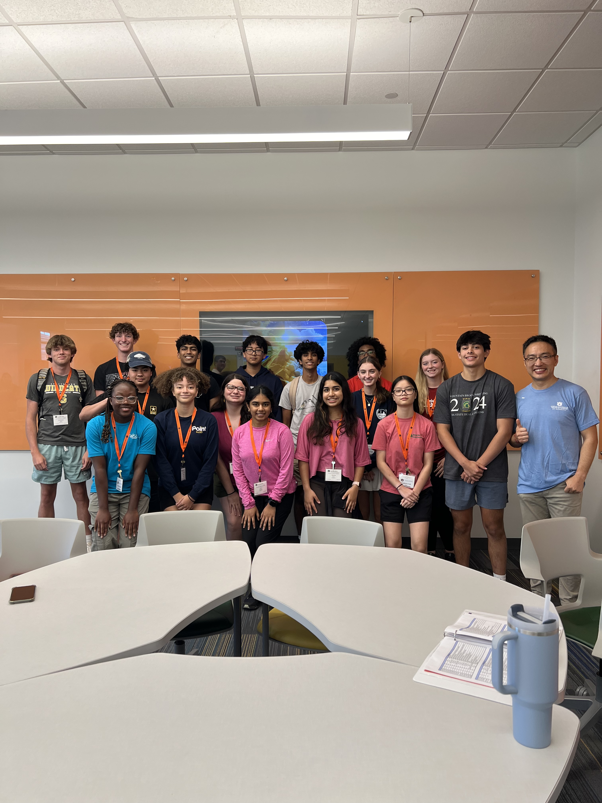

# Year 2024, Summer Science Institute (SSI) at Auburn University
* Presented by the College of Sciences and Mathematics
* Official website https://www.auburn.edu/cosam//outreach/stem_outreach/programs/SSI/index.htm
* June 3-7, 2024


## Talk
* Title: `How do Surfaces Grow?`
* Abstract:
```

In this module, we will embark on a mathematical adventure to explore the
Central Limit Theorem---a cornerstone of statistical theory. We'll dive deep
into why the independence assumption is crucial for its application. Through
dynamic simulations, we will witness the fascinating behavior of sand and snow
piles. Intriguingly, our snow pile simulation unveils a new universality class,
illustrating how seemingly mundane interactions can lead to groundbreaking
discoveries. We'll also traverse through a variety of scenarios where similar
growth phenomena manifest in vastly different contexts. This module highlights
the explosive progress made in understanding growth phenomena over the past few
decades, inviting students to join the quest at the cutting edge of exploration
of mathematics and physics.

```
* Classroom: ACLC 242
* Date and Time: June 5th, Wednesday, 2024, from 15:30-16:30
* Presentation is available [here](http://webhome.auburn.edu/~lzc0090/AU-SSI_2024/#/).

# License

[CC-BY-SA-4.0](./LICENSE)
